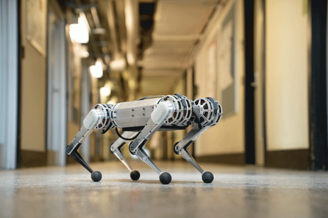

## Why to ML?

> ## Fundamental
> Science is fundamentally data driven.
{: .callout}

|  | 
|:--:| 
| RV Investigator |

|  | 
|:--:| 
| Australian Square Kilometer Array Pathfinder |

|  | 
|:--:| 
| Energy Sector |

> ## Fast
> Machine (Deep) Learning has become the poster child for fast, scalable, exascale compute.
{: .callout}

|  | 
|:--:| 
| Summit Supercomputer |

> ## Smart
> Machine Learning is able to uncover insights in very complex systems without knowledge of the fundamental underlying models.
{: .callout}

|  | 
|:--:| 
| Machine Learning offers a purely data driven approach to scientific discovery. |

## What is ML?

FUJI or PINK LADY

|||||
|||||
|||||

- Traditional models are explicitly programmed
-	ML algorithms are learned
-	Therefore data is very important
-   Predicition vs. understanding
-   Interpretability

<!-- Exercises: -->
<!-- -	Give some examples of explicit programming -->
<!-- -	Give some examples of machine learning -->

## When to ML?
-	Data requirements: LOTS!!! The more the better. *Very* generally speaking you want on the order of 10-100 samples for each feature in your data. So for example in the image processing case where we have 128x128x3 pixels we would want on the order of 500,000 -> 5,000,000 samples.
-	Compute requirements: In the case of deep learning the field is mostly focused on GPUs. 
-	Desired outcomes: Supervised machine learning in particular isn't overly useful for providing insight into data. It is mostly designed for inferencing or predictions. Unsupervsied learning on the other hand offers the opportunity to uncover patterns and relationships in data that were previously unseen.

## Types of ML
-	Supervised (labelled data)
     -  Classification
     -  Regression

-	Unsupervised (unlabelled data)
     - Clustering / segmentation
     - Dimension reduction

- Reinforcement Learning
     - Environemt, state, action 

-	Deep learning



