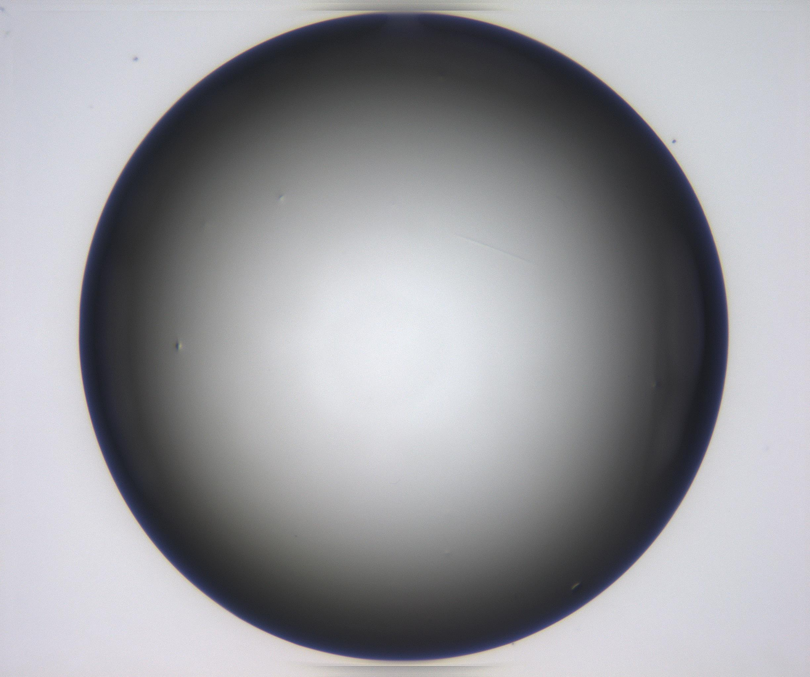
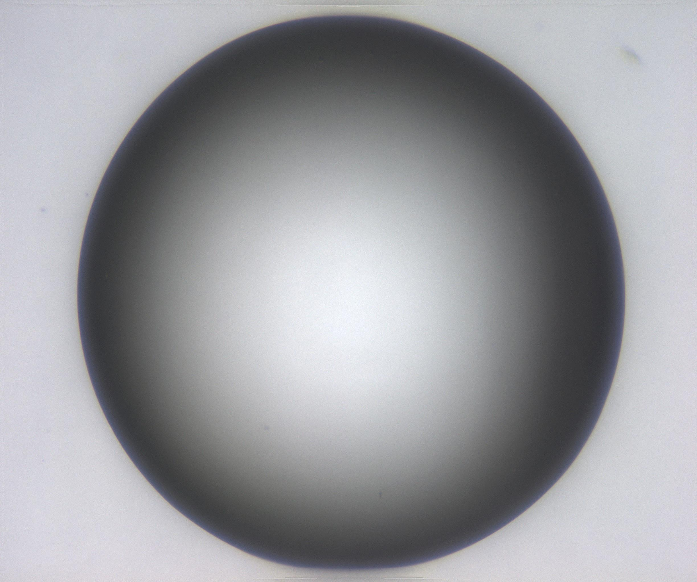
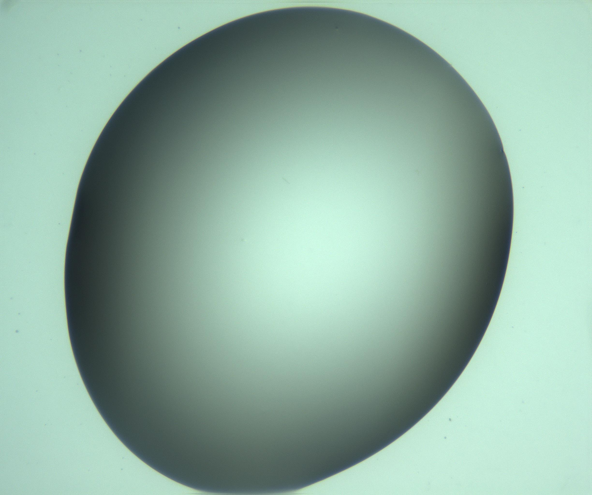
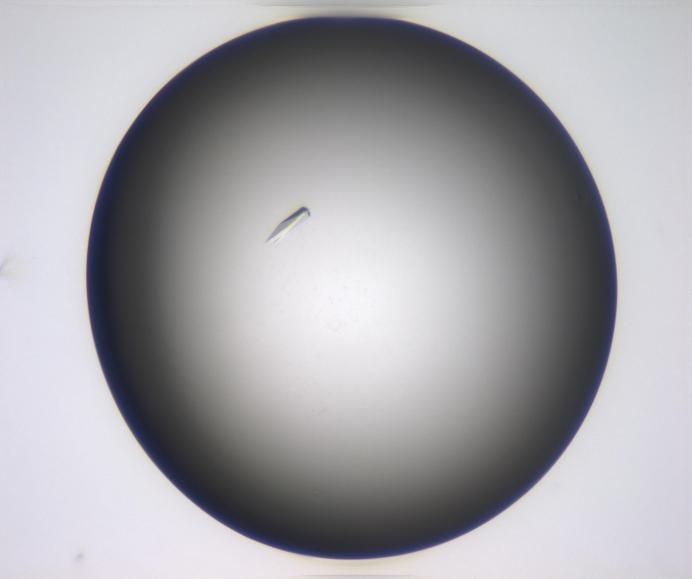
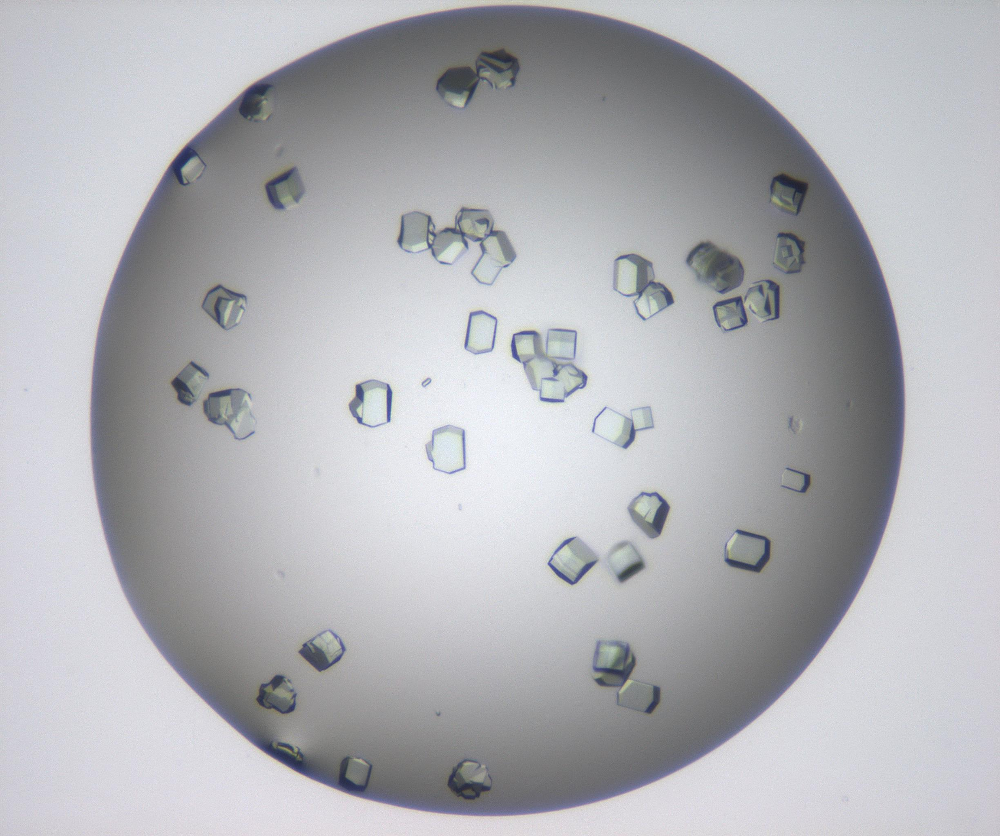
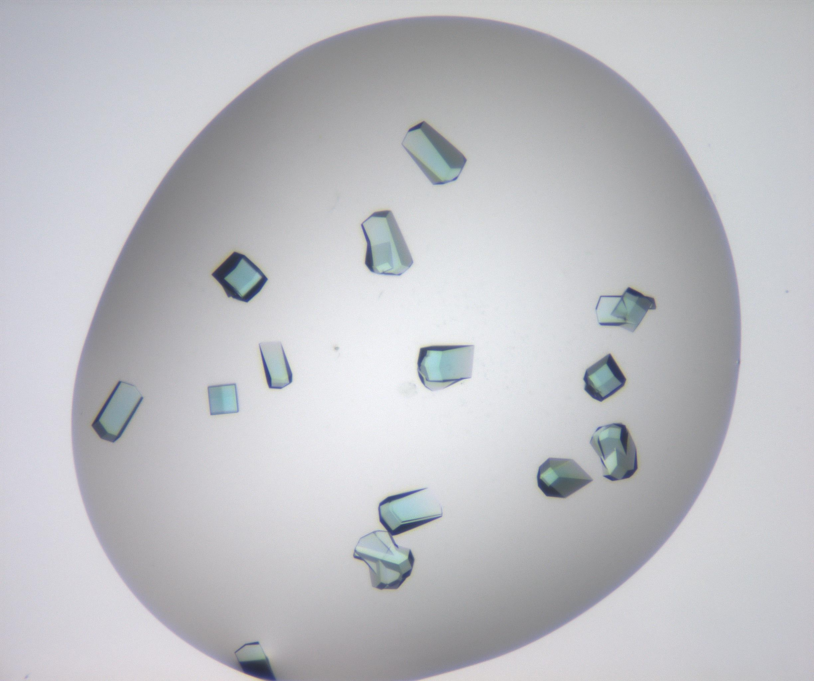
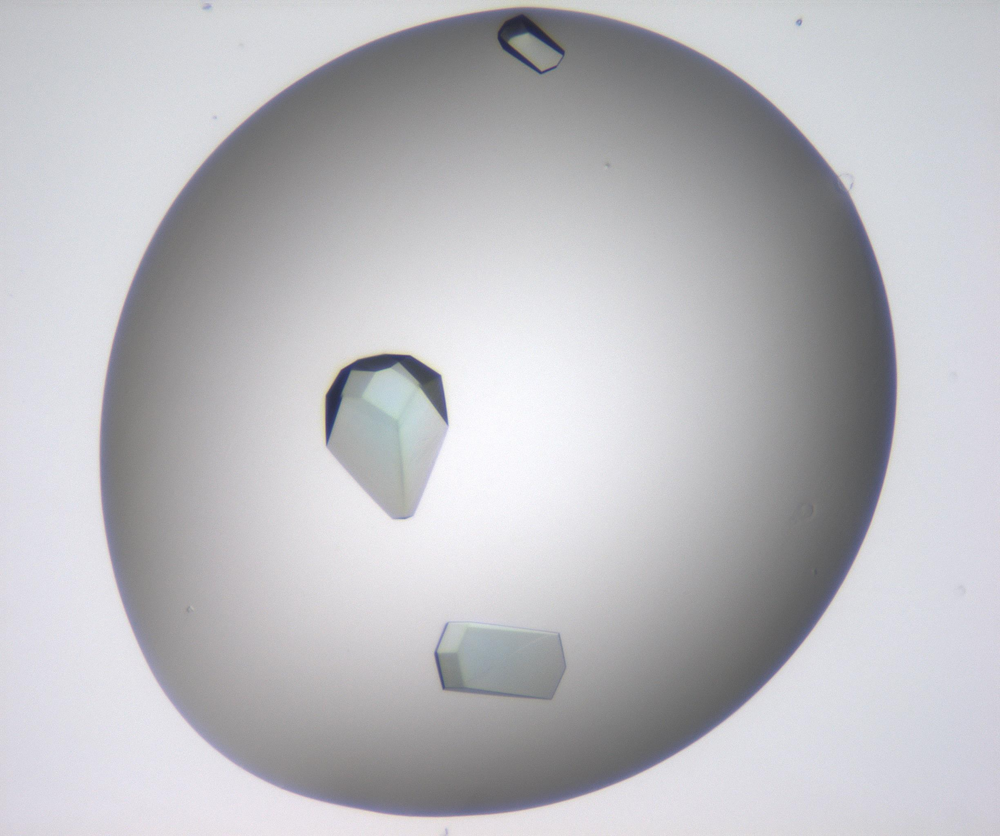

Before the break we saw how machine learning can be useful and even reproduced some state-of-the-art ML results ourselves! Are these results good? How can we be sure our model is performing as best it can? In this episode we will introduce some metrics that are useful for guaging model performance and how we can use these to identify sources of error in our training pipeline.

## Data

The data we were playing with before were essentially numerical time-series data, this time we will have a look at some image data. The dataset we have curated comes from CSIRO's [Collaborative Crystalisation Center (C3)](https://research.csiro.au/crystal/ "C3 Home Page") in Parkville, Victoria.
C3, together with structural biologists, try to crystalise protein samples. Crystallised samples are ideal for obtaining [tertiary structure](https://en.wikipedia.org/wiki/Protein_tertiary_structure "Protein Tertiary Structure Wikipedia") information of protein samples by the application of [x-ray crystallography](https://en.wikipedia.org/wiki/X-ray_crystallography "x-Ray Crystallography Wikipedia") and [synchrotron radiation](https://en.wikipedia.org/wiki/Synchrotron_radiation "Synchrotron Radiation Wikipedia").
It turns out, however, that the process of crystalising a protein is something of a dark art, and essentially amounts to mixing an arbitrary cocktail of chemicals into solution containing the protein and letting the mixture sit for an arbitrary length of time. Some times crystals form. Sometimes they don't. At C3 we broadly classify experiment outcomes into one of four categories; "Clear," "Crystal," "Precipitate" and "Other." Samples of each class are provided below.

| Clear |
:---------------------------:|:----------------------------:|:-----------------------------:|:-----------------------------:
  |   |    |  
| Crystal |
:---------------------------:|:----------------------------:|:-----------------------------:|:-----------------------------:
  |   |    |  

First things first lets download these images into our Collabatory environment

~~~
for thing in collection:
    do_something
~~~
{: .language-python}



