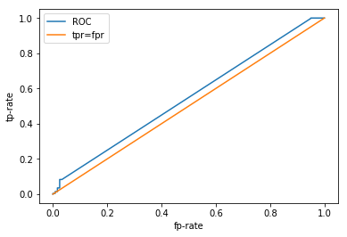
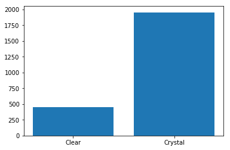
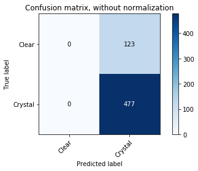

Before the break we saw how machine learning can be useful and even reproduced some state-of-the-art ML results ourselves! Are these results good? How can we be sure our model is performing as best it can? In this episode we will introduce some metrics that are useful for guaging model performance and how we can use these to identify sources of error in our training pipeline.

## Data

The data we were playing with before were essentially numerical time-series data, this time we will have a look at some image data. The dataset we have curated comes from CSIRO's [Collaborative Crystalisation Center (C3)](https://research.csiro.au/crystal/ "C3 Home Page") in Parkville, Victoria.
C3, together with structural biologists, try to crystalise protein samples. Crystallised samples are ideal for obtaining [tertiary structure](https://en.wikipedia.org/wiki/Protein_tertiary_structure "Protein Tertiary Structure Wikipedia") information of protein samples by the application of [x-ray crystallography](https://en.wikipedia.org/wiki/X-ray_crystallography "x-Ray Crystallography Wikipedia") and [synchrotron radiation](https://en.wikipedia.org/wiki/Synchrotron_radiation "Synchrotron Radiation Wikipedia").
It turns out, however, that the process of crystalising a protein is something of a dark art, and essentially amounts to mixing an arbitrary cocktail of chemicals into solution containing the protein and letting the mixture sit for an arbitrary length of time. Some times crystals form. Sometimes they don't. At C3 we broadly classify experiment outcomes into one of four categories; "Clear," "Crystal," "Precipitate" and "Other." Samples of each class are provided below.

| Clear |
:---------------------------:|:----------------------------:|:-----------------------------:|:-----------------------------:
  |   |    |  
| Crystal |
:---------------------------:|:----------------------------:|:-----------------------------:|:-----------------------------:
  |   |    |  

First things first lets download these images into our Collabatory environment

~~~
from utils.datasets import c3
(X_train, y_train), (X_test, y_test) = c3.load_data()
~~~
{: .language-python}

~~~
Downloading datafile to /root/data/crystals.npy ...
... done

Downloading datafile to /root/data/clear.npy ...
... done

Sub-sampling dataset...
... shuffling and splitting
... done
~~~
{: .output}
> ## Authentication
>
>The first time you execute one of the dataset utility functions you will be asked to authenticate with you google credentials, don't be afriad.
>
> ~~~
> Go to the following link in your browser:
>
>    https://accounts.google.com/o/oauth2/auth?redirect_uri=.....
>
>Enter verification code:
> ~~~
> {: .output}
{: .callout}

You can take a sneaky look at some of the images if you would like too
~~~
import random
from matplotlib import pyplot as plt
%matplotlib inline

import numpy as np

random_index = random.randint(0, X_train.shape[0])

test_image = X_train[random_index]
test_image = np.reshape(test_image, (32, 32, -1))

plt.imshow(test_image)
~~~
{: .language-python}

## Model

Okay we have some data, and because we are ML professionals we have split our dataset into training and testing splits. Let's train something! Then we can see how well it performs on the test data.

One of the work horses of late 90's Silicon Valley was the [Support Vector Machine](https://en.wikipedia.org/wiki/Support-vector_machine#History "SVM Wikipedia page") (SVM) algorithm. SVMs are [linear classifiers](https://en.wikipedia.org/wiki/Linear_classifier "Linear Classifier Wikipedia page") that seek to find the (d-1)-dimensional decision boundary the maximises the separation (margin) between the classes on either side of the boundary.

|  | 
|:--:| 
| *Courtesy of Wikipedia: H1 does not separate the classes. H2 does, but only with a small margin. H3 separates them with the maximal margin.* |

We won't dig into the specifics of SVMs here, but you could probably get your hands dirty here, here or here. Let's just jump straight in with some `scikit-learn` code right now. The code below imports the `scikit-learn` SVM implementation, creates and instance of the SVM Classifer model and then trains that model using our training data.

~~~
from sklearn import svm
classifier = svm.SVC(gamma=0.001, verbose=True, probability=True)
classifier.fit(X_train, y_train)
~~~
{: .language-python}
~~~
SVC(C=1.0, cache_size=200, class_weight=None, coef0=0.0,
  decision_function_shape='ovr', degree=3, gamma=0.001, kernel='rbf',
  max_iter=-1, probability=True, random_state=None, shrinking=True,
  tol=0.001, verbose=True)
~~~
{: .output}

That's it! Model is trained. It's that easy :-)

We can take a look at how well the model has trained by checking out the accuracy, both for the training and test sets

~~~
from sklearn import metrics

predicted_train = classifier.predict(X_train)
predicted_test = classifier.predict(X_test)

train_accuracy = metrics.accuracy_score(y_train, predicted_train) * 100.
test_accuracy = metrics.accuracy_score(y_test, predicted_test) * 100.

print("Training accuracy: %.2f%%" % train_accuracy)
print("Test accuracy: %.2f%%" % test_accuracy)
~~~
{: .language-python}
~~~
Training accuracy: 100.00%
Test accuracy: 80.17%
~~~
{: .output}

Whoop! In this instance I got 80% accuracy on the test set. This is incredible, I have done anything and I'm already running at about state of the art. Yes!

## Metrics

Now that we have the pleasantries under control we can start to look at the standard metrics available for measuring model performance. We have already concluded the model is 80%, but is that actually good? There are a range of metrics available to us for assess classification performance, particularly in the case of a binary classifier. To understand these metrics we first need to understand how we can be right and how we can be wrong. In total there are four ways; correctly predicting a positive sample, *true positive*, incorrectly predicting a positive sample, *false positive* (Type I error), correctly predicting a negative sample, *true negative* and incorrectly predicting a negative sample, *false negative* (Type II error). These outcomes are summarised below.

|             | Predicted Class            | 
|:------------|:---------------------------|
| **True Class**  | Positive | Negative | Total|
|:------------|:---------|:---------|:-----|
| Positive    | tp : true positive  | fn : false negative | p |
| Negative    | fp : false positive | tn : true negative | n |
|:------------|:---------|:---------|:-----|
| Total       | p'       | n'       | N    |
|:------------|:---------|:---------|:-----|

With these definitions in mind we can build a collection of standard metrics:

| Metric      | Formula                   |  `scikit-learn` Function |
|:------------|:--------------------------|:-----------------------|
| error       | (fp + fn) / N             | 1 - `metrics.accuracy_score` |
| accuracy    | (tp + tn) / N = 1 - error | `metrics.accuracy_score` |
|:------------|:--------------------------|:-----------------------|
| tp-rate     | tp / p                    | `metrics.recall_score` |
| fp-rate     | fp / n                    |                        |
|:------------|:--------------------------|:-----------------------|
| precision   | tp / p'                   | `metrics.precision_score` |
| recall      | tp / p = tp-rate          | `metrics.recall_score` |
|:------------|:--------------------------|:-----------------------|
| sensitivty  | tp / p = tp-rate          | `metrics.recall_score` |
| specificity | tn / n = 1 - fp-rate      |                        |
|:------------|:--------------------------|------------------------|
| F1 score    | 2 * (recall * precision) / (recall + precision) | `metrics.f1_score` |
|:------------|:--------------------------|------------------------|

Accuracy and error are metrics we are generally familiar with and have no special meaning here. The true positive rate tells you what fraction of true sample you correctly identified, similarly the false positive rate tells you what fraction of negative samples were incorrectly identified as positive. Precision and recall are usually more concisely illustrated through a diagram.

|  | 
|:--:| 
| *Courtesy of Wikipedia: Precision and recall.* |

Precision can be intuitively understood as the fraction of selected items that are relevent and recall as the fraction of relevant items selected. The F1 score is the weighted average of precision and recall. This metric is more useful when you have an uneven class distribution, i.e. more positive samples than negative samples. The accuracy score essentially gives an equal weighting to both positibe and negative samples, however the F1 metric will balance the ratio of false positives and false negatives.

When you have K > 2 classes, things become a little more difficult to analyse. In the simplest case you can define K two-class problems each separating one class from the K-1 other classes and apply each of the metrics above. Another alternative is to create the confusion matrix where each element Cij contains the number of samples whose true label was i and predicted label was j. The prefect confusion matric would contain all non-zero values along the diagonal with the off-diagonal elements all equal to 0. The confusion matrix is a nice way to see, in an instant, if there particular classes that are regularly confused with other classes, especially when using a package that can apply a heat map.

|  | 
|:--:| 
| *Courtesy of scikit-learn: Confusion matrix for the Iris dataset.* |

The final performance evaluation technique that is often used is the [Receiver Operator Characteristic](https://en.wikipedia.org/wiki/Receiver_operating_characteristic "ROC Curve Wikipedia page") (ROC) Curve. When working with a binary classifier there is typically a single value that determines the outcome, say the probability of being in the positive class, p in [0,1]. Ideally you would want this classifier to return true positives when p > 0.5 and true negatives when p < 0.5, however this is often not the case. We can, however, tune the performance of the model to suit our application. By shifting the threshold value (0.5 in this case) we can tune the ratio of false positives and true positives. Sliding this threshold up and down, from 0 to 1, we can generate a set of co-ordiante pairs (fpr, tpr) which describe a curve in the unit square.

|  | 
|:--:| 
| *Courtesy of scikit-learn: Example of an ROC curve for a multi-class classification problem.* |

The ultimate choice of threshold depends on the application. Are you more sensitive to false positives or false negatives? Is there a minimum acceptable number of false positives?

An ROC curve will never sit below the line tpr=fpr, this lines represents a classifier whos predictions are completely random. The ideal classifier exists in the top left corner, where fpr=0 and tpr=1, i.e. we have correctly identified all of the positive samples and haven't incorrectly labelled any negatives as positive. To capture the qualities of the ROC curve with a single metric you can calculate the Area Under the Cruve (AUC), which will be a number between 0.5 and 1., with 1. being the ideal scenario.

[Enough jibber jabber](https://youtu.be/7zOLr8uV3sU?t=15 "Mr T Add"), let's see how our classifier performs! Remember we had a 100% training accuracy and an 80% test accuracy, we were pretty happy with ourselves. So we can probably anticipate some pretty sweet results here.

~~~
from sklearn.metrics import roc_curve, roc_auc_score

probabilities = classifier.predict_proba(X_test)

fpr, tpr, _ = roc_curve(y_test, probabilities[:, 0])

plt.plot(fpr, tpr, label="ROC")
plt.plot([0, 1], [0, 1], label="tpr=fpr")

plt.xlabel("fp-rate")
plt.ylabel("tp-rate")
plt.legend()

print("AUC: %.2f" % roc_auc_score(y_test, probabilities[:, 0]))
~~~
{: .language-python}
~~~
AUC: 0.55
~~~
{: .output}

> ## Challenge
>Try plotting the ROC curve for the training data on the same axis. Why does it look that way?
{: .challenge}

WHHHAAAATTT???!!!!

This does not look very good, what is going on here? We had an 80% test accuracy, surely our ROC curve would be better than this? Let's take a look at some of the other metrics. `scikit-learn` has a nice function that returns a few of the more popular metrics in a single report .

~~~
print("Classification report for classifier %s:\n%s\n"
       % (classifier, metrics.classification_report(y_test, predicted_test)))
~~~
{: .language-python}
~~~
Classification report for classifier SVC(C=1.0, cache_size=200, class_weight=None, coef0=0.0,
  decision_function_shape='ovr', degree=3, gamma=0.001, kernel='rbf',
  max_iter=-1, probability=True, random_state=None, shrinking=True,
  tol=0.001, verbose=True):
              precision    recall  f1-score   support

         0.0       0.00      0.00      0.00       120
         1.0       0.80      1.00      0.89       480

   micro avg       0.80      0.80      0.80       600
   macro avg       0.40      0.50      0.44       600
weighted avg       0.64      0.80      0.71       600
~~~
{: .output}

Hmmm... okay. I think we are starting to get a clearer picture now. Look at the individual class metrics. In particular the recall, that is the fraction of samples identified as positive that were actually positive. We have a reacll of 0 for the "clear" class and a recall of 1 for the "crystal" class. So we are getting all of the crystal samples correct and missing all of the clear samples. How might that happen? If we **predict every sample to be crystal**, we would see the above behaviour. So why would our model learn to do that? Let's have a look at the class distribution

~~~
num_clear = len(y_train[y_train == 0])
num_crystal = len(y_train[y_train == 1])
p1 = plt.bar([0, 1], [num_clear, num_crystal])
plt.xticks([0, 1], ("Clear", "Crystal"))

print("Fraction of samples assigned to the crystal class: %.2f%%" % (num_crystal / len(y_train) * 100.))
~~~
{: .language-python}
~~~
Fraction of samples assigned to the crystal class: 81.38%
~~~
{: .output}

Oh. Our class distribution is severely unbalanced. We have way more crystals than not crystals. The proportion of crystals seems to be suspiciously similar to the accuracy we were estimating on our test data. The picture is a lot clearer now. It looks like our classifier has simply learned to classify everything as the majority class as doing so results in quite a reasonable accuracy. We can demonstrate this explicitly by looking at the confusion matrix.

~~~
from utils.plotting import plot_confusion_matrix

plot_confusion_matrix(y_test, predicted_test, classes=np.array(["Clear", "Crystal"]))
~~~
{: .language-python}
~~~
Confusion matrix, without normalization
[[  0 123]
 [  0 477]]
~~~
{: .output}



